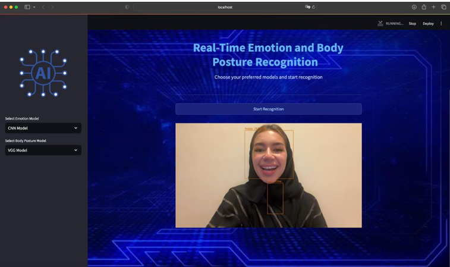

# Real-Time Facial Emotion & Body Posture Recognition for Student Evaluation

> A computer-vision system that analyzes facial expressions and body posture to provide counselors with objective, real-time insights into students’ emotional states, supporting timely and effective interventions.

## Table of Contents
- [Overview](#overview)
- [Key Features](#key-features)
- [Project Scope & Target Users](#project-scope--target-users)
- [Datasets](#datasets)
- [Methodology](#methodology)
- [Modeling & Results](#modeling--results)
- [Demo](#demo)
- [Installation](#installation)
- [Usage](#usage)
- [Repository Structure](#repository-structure)
- [Ethical Considerations](#ethical-considerations)
- [Roadmap / Future Work](#roadmap--future-work)
- [Team](#team)
- [Acknowledgments](#acknowledgments)
- [Citation](#citation)
- [License](#license)

---

## Overview
Traditional observation of students’ non-verbal cues (facial expressions, posture) can be subjective and inconsistent. This project integrates deep learning and computer vision to recognize emotions in real time from face and body signals, giving school counselors actionable, objective indicators during sessions.

## Key Features
- Real-time video inference (camera feed) for facial emotion & body posture recognition.  
- Multiple deep learning backbones evaluated (CNN, VGG16, EfficientNetB0 for face; YOLO, VGG16, CNN for posture).  
- Streamlit-based interactive interface for deployment and demos.  
- Objective insights designed for counseling settings and educational support.

## Project Scope & Target Users
- **Scope:** Automated analysis of facial expressions and body posture relevant to student engagement and well-being.  
- **Users:** School counselors and educators who need real-time, unbiased emotional state indicators, especially when students struggle to express feelings verbally.

## Datasets
- **Facial Expression Recognition (Kaggle)** — ~35.9K images across 7 classes: anger, disgust, fear, happy, neutral, sad, surprise.  
- **Body Posture Recognition** — Expanded to **1,612** images and **6** classes: angry, fearful, happy, sad, neutral, stress; augmented to ~3,000 images for training robustness.

## Methodology
1. **Data Collection**: public datasets (Kaggle), collaboration (body posture), and self-collection.  
2. **EDA**: balance checks, color channel stats, size distributions, PCA visualizations, and optical flow explorations.  
3. **Preprocessing**: class imbalance handling, resizing, labeling, data augmentation.  
4. **Modeling**: experiments with CNN, VGG16, EfficientNetB0 for facial emotions; YOLO, VGG16, CNN for posture.  
5. **Evaluation**: accuracy, precision, recall, F1-score, confusion matrices, learning curves.

## Modeling & Results

### Facial Emotion Recognition
- **CNN Model**: Achieved **92.3% accuracy** with a 70/30 train-validation split. Strong performance, though some overfitting noted.  
- **VGG16 Model**: Achieved **63% accuracy**. While modest, the model showed promise in live recognition scenarios, consistently detecting emotions reliably.  

### Body Posture Recognition
- **YOLO Model**: Achieved **94% accuracy**. Demonstrated robust performance with minimal overfitting, strong generalization to unseen data.  
- **Fine-tuned VGG16 Model**: Achieved **95% accuracy**. Strong performance, slight overfitting, but reliable across diverse scenarios.  
- **CNN Model**: Achieved **95% accuracy**. Consistent across training and validation, effective in handling real-time body posture recognition.  

### Summary Table
| Category       | Model   | Accuracy |
|----------------|---------|----------|
| Facial Emotion | CNN     | 92.3%    |
| Facial Emotion | VGG16   | 63.0%    |
| Body Posture   | CNN     | 95.0%    |
| Body Posture   | VGG16   | 95.0%    |
| Body Posture   | YOLO    | 94.0%    |

## Demo
Here is a screenshot of the final deployed platform (Streamlit app):



*(Place the screenshot file in a folder called `images/` in your repo and rename it `final_demo.png`.)*

## Installation
```bash
python -m venv .venv
source .venv/bin/activate   # macOS/Linux
.venv\Scripts\activate    # Windows

python -m pip install --upgrade pip
pip install tensorflow opencv-python streamlit numpy matplotlib scikit-learn
```

## Usage
1. Place trained model weights in `models/`.  
2. Run:  
   ```bash
   streamlit run App.py
   ```

## Repository Structure
```
.
├── App.py
├── FERBody.py
├── FacialEmotion.py
├── Body_recognition.ipynb
├── Facial_Emotion.ipynb
├── Facial_Emotion.-Updated.ipynb
├── Facial_Emotion_Recognition_Updated.ipynb
├── Final-Application.ipynb
├── body_posture_recognition.ipynb
├── body-posture-recognition.ipynb - Colab.pdf
├── models/                # (place trained models here)
├── images/                # (screenshots, demo images)
└── README.md
```

## Ethical Considerations
- Respect privacy and obtain informed consent.  
- Secure storage of images/videos.  
- Avoid high-stakes decisions based solely on predictions.

## Roadmap / Future Work
- Improve facial emotion accuracy.  
- Expand posture labels.  
- Enhance robustness to varied conditions.  
- Optimize for edge devices.

## Team
- Afnan Abdullah Alshehri  
- Amjad Khalid Alhothari 
- Ghida Khodran Alzahrani 
- Jood Abdullah Alamoudi  
- Layan Osama Alhadrami 
Supervised by **Dr. Alaa Alsaig**, University of Jeddah.

## Acknowledgments
We thank all supervisors, coordinators, and contributors acknowledged in the report.

## Citation
> *Real-Time Facial Emotion and Body Posture Recognition System for Student Evaluation — Senior Project, University of Jeddah, Spring 2024.*

## License
This repository is for academic/educational use. Consider MIT or Apache-2.0 license.
